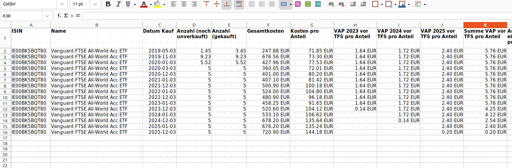
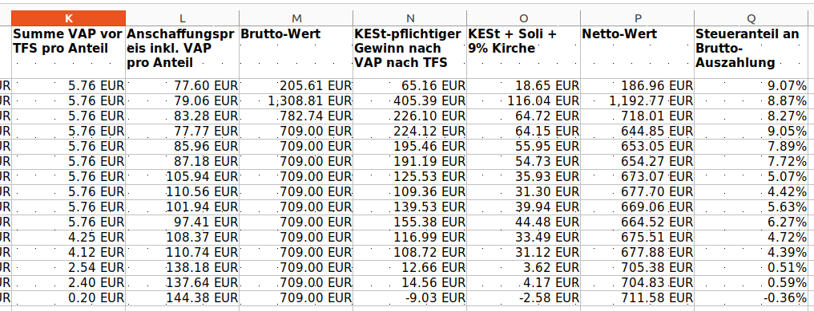
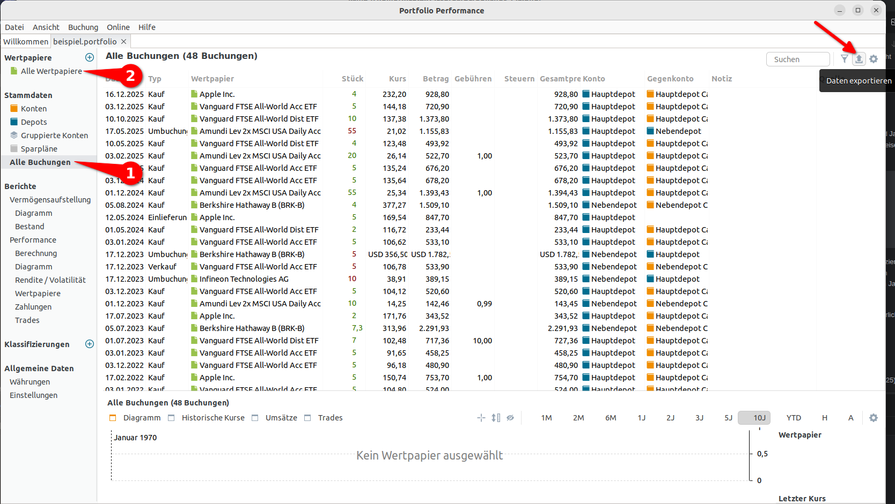
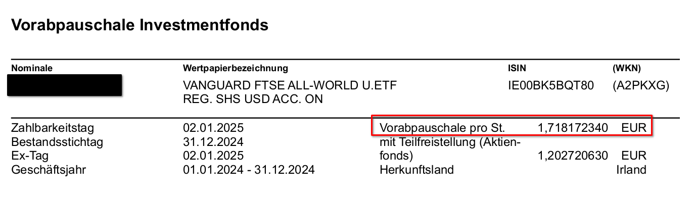

# pyfifovap

Tool zur steuerlich korrekten Gewinnberechnung in DE mit Portfolio Performance-Exporten

Hauptentwickler: Nico Spohrer

## Anwendungsfälle

Du hast dein Wertpapier-Depot in [Portfolio Performance](https://www.portfolio-performance.info/) gepflegt und möchtest

- eine bestimmte Menge an steuerpflichtigen Kapitalerträgen realisieren, bspw. zur Nutzung
  des [Sparer-Pauschbetrags](https://de.wikipedia.org/wiki/Sparer-Pauschbetrag)
  oder [Grundfreibetrags](https://de.wikipedia.org/wiki/Grundfreibetrag_(Deutschland)) im Rahmen
  der [Günstigerprüfung](https://www.haufe.de/id/beitrag/einkuenfte-aus-kapitalvermoegen-125-guenstigerpruefung-HI9285932.html)
- die nach [FIFO](https://www.smartbrokerplus.de/de-de/wiki/fifo/) zuerst zu verkaufenden Chargen pro Wertpapier und
  Depot identifizieren
- den effektiven steuerlichen Anschaffungspreis pro Charge herausfinden
- die genaue steuerliche Auswirkung von [Vorabpauschalen](https://www.bvi.de/faq/faq-vorabpauschale/) beim Verkauf von
  Fonds wie ETFs berechnen
- die [Teilfreistellung](https://www.consorsbank.de/web/Wissen/FAQ/steuer/Teilfreistellung) von Aktien- und Mischfonds
  beim Verkauf berücksichtigen
- eine Entnahme aus einem von mehreren Depots vornehmen und dabei möglichst wenig steuerpflichtige Erträge realisieren,
  um die Kapitalertragsteuer (+ Soli + ggf. Kirchensteuer) zu minimieren
- Teildepotüberträge zur [FIFO-Optimierung](https://www.stbg-wf.de/umgehen-des-fifo-verfahrens/) durchführen

pyfifovap ist ein Werkzeug zur Planung, nicht zur Erstellung von Steuererklärungen oder Performance-Berechnung im
Nachgang.
Es erzeugt eine XLSX-Datei, die mit LibreOffice Calc/Excel/Google Sheets geöffnet werden und für weitere Berechnungen
genutzt werden kann.

Die Berechnung des steuerpflichtigen Gewinns folgt den üblichen Regeln von Kapitalerträgen und kann Vorabpauschalen (
ggf.) und Teilfreistellungen (ggf.) für alle noch unverkauften Anteile berücksichtigen.
Für die Berechnung der darauf fälligen Steuer wird angenommen, dass auf den Gewinn Kapitalertragsteuer + Soli +
Kirchensteuer (ggf.) gezahlt werden muss.
Falls im persönlichen Fall bspw. ein ausreichend großer Verlusttopf oder freier Sparer-Pauschbetrag vorhanden ist, wäre
die zu zahlende Steuer jedoch möglicherweise null.
Ähnlich verhält es sich bei der Nutzung des Grundfreibetrags im Rahmen der Günstigerprüfung.
Für solche Anwendungsfälle muss also logischerweise der KESt-pflichtige Gewinn betrachtet werden.

## Beispiel-Ergebnis

pyfifovap erzeugt eine große XLSX-Datei mit einem Tab je Wertpapier und je
Depot ([Beispiel-XLSX](https://github.com/nspo/pyfifovap/raw/refs/heads/master/Beispiele/Ergebnisse.xlsx)).
Dort sind alle Chargen aufgelistet, die noch nicht (vollständig) verkauft oder zu anderen Depots übertrage wurden.
Im folgenden ein Beispiel für ETF-Anteile, für die schon in mehreren Jahren eine Vorabpauschale angefallen ist und
für die eine Teilfreistellung von 30% gilt:





Beim alleinigen Verkauf der ersten Charge sollten in diesem Beispiel ca. 18,65 EUR an Steuern abgezogen werden (erste
Zeile, letzte Spalten).
In der letzten Zeile rechts sieht man, dass für diese Charge ein negativer Kapitalertrag bestimmt wurde, der zu einer
kleinen Steuererstattung führen sollte, weil in den vorherigen Chargen bereits Gewinne aufgelaufen sind.

Mit `--gewinne-vorhanden` kann auch die Annahme getroffen werden, dass praktisch "unendlich" Gewinne des entsprechenden
Typs im Kalenderjahr vorhanden sind, die mit Verlusten verrechnet werden könnten.
Jeglicher Verkauf von Verlust-Chargen wird dann zu einer Steuererstattung (Steuer < 0) führen, unabhängig davon, ob nach
FIFO ältere Chargen mit Gewinnen vorhanden sind.

## Voraussetzungen

- Alle relevanten Buchungen sind in Portfolio Performance eingepflegt
- Die Basiswährung in Portfolio Performance ist EUR (Wertpapiere notiert in Fremdwährungen werden jedoch prinzipiell
  auch
  unterstützt)
- Es geht um KESt-pflichtige Wertpapiere wie Fonds/ETFs oder Aktien
- Dir ist klar, dass dieses Werkzeug Fehler beinhalten kann und keine Steuerberatung darstellt
- Du bist steuerpflichtig in Deutschland :)
- Du kannst ein Python-Skript starten

## Anleitung

Grundlegend:

- Portfolio Performance öffnen
- Unter "Alle Buchungen" -> "Daten exportieren" (ganz rechts) einen CSV-Export der Buchungen erstellen
- Unter "Alle Wertpapiere" -> "Daten exportieren" (ganz rechts) einen CSV-Export der Wertpapiere erstellen.
    - Dies ist zwar nicht Pflicht zur Nutzung des Werkzeugs, ohne kann allerdings nur der steuerliche Anschaffungspreis
      statt vollständigen Details zum aktuellen Gewinn bei Realisierung bestimmt werden



- pyfifovap herunterladen und ggf. benötigte Bibliotheken installieren (z. B. `pip3 install -r requirements.txt`)
- pyfifovap ausführen und eine große XLSX-Datei als Ergebnis erhalten:

```bash
$ ./main.py --buchungen Alle_Buchungen.csv --wertpapiere "Wertpapiere_(Standard).csv"
Generiere Ergebnis-XLSX-Datei Ergebnisse.xlsx...
```

- Der erste Versuch ist fertig! Hier sind ggf. jedoch Teilfreistellung und Vorabpauschalen noch nicht berücksichtigt.
  Dies
  kann konfiguriert werden.
- Die Hilfeseite `--help` betrachten schadet auch nicht!

Alternativ können Beispiel-Daten genutzt werden:

```bash
$ ./main.py -b Beispiele/Alle_Buchungen.csv -w "Beispiele/Wertpapiere_(Standard).csv"
```

## Vorabpauschalen (VAP) richtig berechnen

Zur korrekten Berechnung bereits versteuerter Vorabpauschalen muss pyfifovap pro Wertpapier und Jahr
(jedoch nicht pro Charge!) die Information erhalten, welche VAP angefallen ist.
Dies wird beispielsweise auf folgende Weise konfiguriert:

```csv
ISIN,Name,Jahr des Wertzuwachses,Vorabpauschale vor TFS pro Anteil
IE00BK5BQT80,Vanguard FTSE All-World Acc ETF,2023,1.63781
IE00BK5BQT80,Vanguard FTSE All-World Acc ETF,2024,1.71817
IE00BK5BQT80,Vanguard FTSE All-World Acc ETF,2025,2.39935
IE00B3RBWM25,Vanguard FTSE All-World Dist ETF,2023,0.0
IE00B3RBWM25,Vanguard FTSE All-World Dist ETF,2024,0.0
IE00B3RBWM25,Vanguard FTSE All-World Dist ETF,2025,0.39021
```

Die hier je Jahr gelistete VAP darf noch nicht durch eine ggf. vorhandene
Teilfreistellung (TFS) reduziert sein.
Falls genug Ausschüttungen in einem Kalenderjahr vorhanden waren, ist die VAP ggf. 0 (wie in zwei von drei Jahren
des genanntenten Dist-ETFs) oder klein (wie in der letzten Zeile).
Sollte für ein Jahr kein Eintrag existieren, gilt die implizite Annahme, dass hierfür keine VAP anfällt.

Hinweis: Die tatsächlichen **Vorabpauschalen fürs Jahr 2025** stehen aktuell (Dezember 2025) natürlich noch nicht sicher
fest.

### VAP-Einträge bestimmen

Gute Broker sollten eine klare Abrechnung bereitstellen, wie viel Vorabpauschale angefallen ist.
Im folgenden ein Beispiel der DKB für das Jahr 2024 (VAP 2024, gilt als zugeflossen Anfang Januar 2025):



Es muss darauf geachtet werden, dass die VAP ohne Teilfreistellung (d.h. der höhere Betrag) und
pro Anteil übertragen wird.
Beide ist im markierten Feld gegeben ohne weitere Berechnungen.

Die VAP kann natürlich auch selbst
manuell [berechnet](https://www.finanztip.de/indexfonds-etf/etf-steuern/vorabpauschale/)
werden, jedoch ist hierbei insbesondere auf eine gute Quelle für den Anteilspreis am Jahresanfang zu achten.

### Datei `etf_vorabpauschalen.csv` updaten

Es wird bereits eine Datei mit einigen VAP-Werten zur Verfügung gestellt.
Bei Updates ist wichtig, dass

- die **Namen** und ISINs von Wertpapieren genau zur Schreibweise in Portfolio Performance passen
- Die englische Schreibweise von Dezimalzahlen (`1.71817`) mit Punkt statt Komma als Dezimaltrenner verwendet wird

## Teilfreistellung (TFS) von Aktien- und Mischfonds berücksichtigen

Bei Fondsanteilen, für die eine [Teilfreistellung](https://www.consorsbank.de/web/Wissen/FAQ/steuer/Teilfreistellung)
gilt, muss einmalig eine Zeile in der Datei `etf_metadaten.csv` hinzugefügt werden:

```csv
ISIN,Name,Prozent Teilfreistellung
IE00BK5BQT80,Vanguard FTSE All-World Acc ETF,30
IE00B3RBWM25,Vanguard FTSE All-World Dist ETF,30
FR0010755611,Amundi Lev 2x MSCI USA Daily Acc ETF,30
FR0014010HV4,Amundi Lev 2x MSCI World Daily Acc ETF,30
IE000716YHJ7,Invesco FTSE All-World Acc ETF,30
```

## Wertpapiere in Fremdwährungen

Für Wertpapiere in Fremdwährungen außer USD und GBP ist aktuell noch keine Forex-Kurs-Abfrage implementiert, dies ist
jedoch durch eine triviale Code-Änderung (1 Zeile) möglich (`ForexHelper`-Klasse).

Der einzige mögliche Kontakt ins Internet bei Nutzung von pyfifovap ist dieser optionale Abruf von Fremdwährungskursen.
Falls auch dies vermieden werden soll, kann die Option `--offline` genutzt werden.
Selbstverständlich wird in keinem Fall eine Information über das Depot ins Internet übertragen (außer, dass ein
Fremdwährungskurs abgefragt wird).

## Mögliche Stolpersteine

- Dieses Werkzeug kann Fehler enthalten und ist noch jung. Es ist keine Steuerberatung.
- Die Nutzung ergibt nur für Wertpapiere Sinn, die der Kapitalertragsteuer unterliegen - also bspw. nicht bei
  Kryptowährungen, Immobilien usw.
- Die VAP pro Wertpapier und Jahr und die Teilfreistellung von Fonds müssen als Eingangswert geliefert werden (s.o.).
  Pro Wertpapier mit VAP ist ggf. jedes Jahr ein weiterer VAP-Wert hinzuzufügen.
- Es ist möglich, dass noch nicht alle relevanten Transaktionstypen aus Portfolio Performance unterstützt werden.
  Aktuell werden berücksichtigt: `Kauf`, `Verkauf`, `Umbuchung (Ausgang)` (Nutzung der Details der ursprünglich
  gekauften Charge - entspricht Depotübertrag), `Einlieferung` (Nutzung der Werte bei der Einlieferung)

## Bug Reports

Falls du Fehler entdeckst, melde diese gerne über Github (als Issue).
Bitte beschreibe das Problem möglichst genau und nutze `-vv` als Kommandozeilenparameter für mehr Debug-Output. Auch
wäre
es sinnvoll, die Input-CSV-Dateien mitzuschicken (ggf. aus Privatsphäregründen gekürzt, damit nur noch das Problem
reproduziert werden kann), ggf. via Mail.
